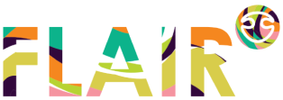

  

 
UI library FLAIR

 by  Aurélie et Valentin  
 
   Flair est une application pour rejoindre ou retrouver ses amis perdus lors d'évènements type festivals, concerts, compétitions sportives... partout ou il y a de la foule et ou on ne veut pas finir tout seul!  

 
 Nous avons designé cette appli sur l'outil Figma car il permet de travailler en collaboration en simultané et en temps réel.
 
 Lien Figma Application : https://www.figma.com/file/bCqkTTVebuUaZThKraBrzq/FLAIR?node-id=0%3A1
 
 Nous avons également crée le design system afin de faciliter le travail des potentiels devellopeurs : cela permet de gagner du temps, de communiquer plus facilement et d'avoir plus de précision.
 
Lien Figma Design system : https://www.figma.com/file/bCqkTTVebuUaZThKraBrzq/FLAIR?node-id=291%3A0

Aurel aime renommer les couleurs et mettre sa touche d'humour mais heuresement Valentin est la pour apporter sa précision et sa rigeur

 
